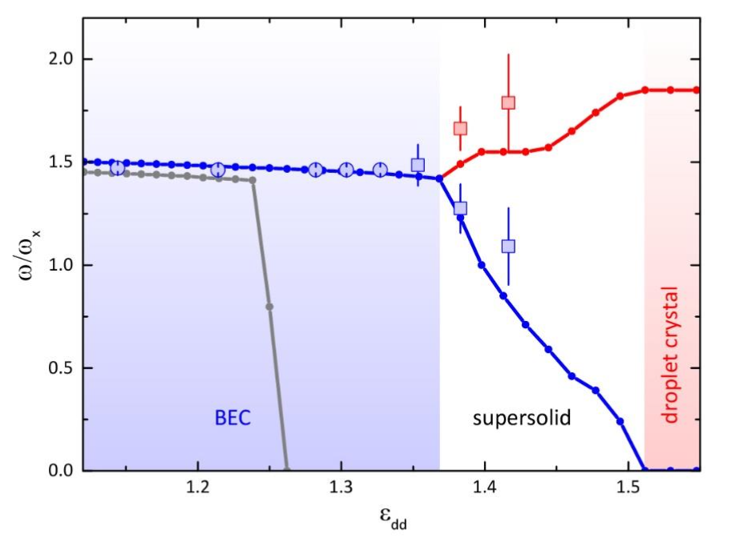

# MF+LHY frequency study for different values of $\mathcal{E}_{dd}$ (1.38, 1.42 and 1.46)

- The idea here is to reproduce different values of $\mathcal{E}_{dd}=1.42$ in Fig. 2 of https://arxiv.org/abs/1906.02791

